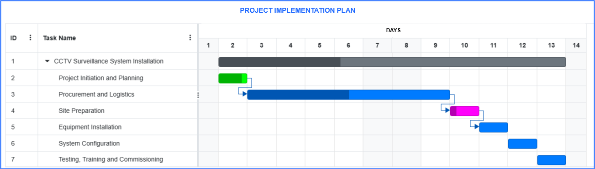

# 🔐 Integrated Security Solution Designs Portfolio

Welcome to my portfolio of **Integrated Security System Designs**.  
Here I demonstrate my approach to creating **scalable, reliable, and secure solutions** for modern facilities.  

---

## 📷 Third Party Camera Integration into AJAX Ecosystem

  

**Description:**  
Design showing how **third-party CCTV cameras** can be integrated into the **AJAX security platform** for unified monitoring and event correlation. This enables seamless video verification when alarms are triggered.  

---

## 🔑 Multi-door Access Control(Without Door Controller)

  

**Description:**  
An **access control system design**, supporting secure entry management, user role assignments, and integration with CCTV for real-time video validation of access events.  

---

## 🚨 Alarm Integration

  

**Description:**  
A design of **AJAX CCTV surveillance System**, providing cloud live streams and events management combined with instant video verification for enhanced situational awareness.  

---

## 🎛 CCTV Network Architecture

  

**Description:**  
A **point-to-point (PtP) CCTV network architecture** showcasing long-distance video transmission via optical fiber link. Network optimization, and centralized monitoring for perimeter protection.  

---

## Unified Security Management System(Axxon PSIM)

  

**Description:**  
A design of **AxxonSoft PSIM (Physical Security Information Management)** solution that unifies multiple subsystems—CCTV, access control, and alarms—into a single security management system.  

---

## Microsoft Dynamics and Access Control Integration

  

**Description:**  
System architecture showing how **Microsoft Dynamics 365** can be integrated with access control platforms for **visitor management, audit trails, and identity synchronization**.  

---

## Point-to-point Perimeter Surveillance

  

**Description:**  
A **point-to-point perimeter CCTV design**, showing wireless links for connecting distributed cameras across large sites while maintaining reliable video streams back to a central control room.  

---

## CCTV Surveillance for Co-working Space

  

**Description:**  
Design for a **Co-shared Workplace CCTV system**, featuring scalable video storage, advanced analytics, and centralized control to support large surveillance deployments.  

---

## Risco wired Alarm System

  

**Description:**  
Architecture of a **Risco alarm system**, highlighting intrusion detection and safety alarm integration, and connectivity to remote monitoring centers.  

---

## Single Point Access Control System(Time and Attendance Clock in/out)

  

**Description:**  
A **single-door access control setup**, ideal for small facilities, showing secure door controller integration with card readers, exit buttons, and optional biometric devices. Can also be used as time and attendance clock in or out station. 

---

## Integration of wired System to Ajax Wireless Ecosystem

  

**Description:**  
Design showing how **legacy wired intruder alarm systems** can be integrated with **wireless AJAX solutions**, allowing modernization while leveraging existing infrastructure.  

---

## Project Implementation Plan

  

**Description:**  
A **project implementation roadmap** outlining phases for deploying an integrated security solution—from requirements gathering to system deployment and maintenance.  

---

## 📬 Contact

- **Name:** Gerald Ochieng  
- **LinkedIn:** [www.linkedin.com/in/geraldoduo]  
- **Email:** geraldoduo@gmail.com  

---

✨ Thank you for visiting!  
